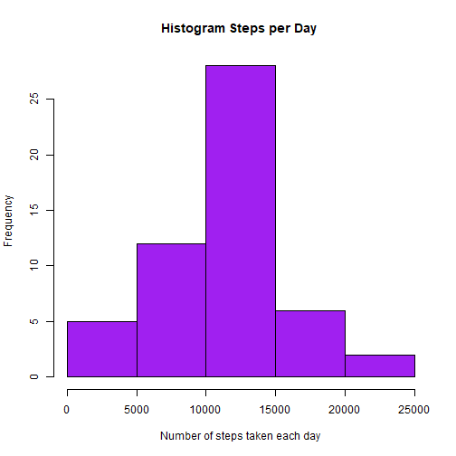
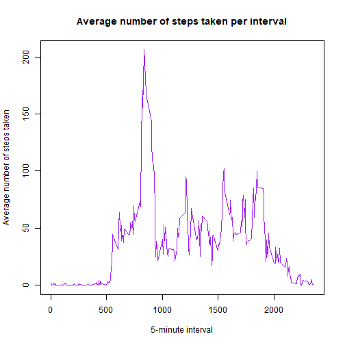
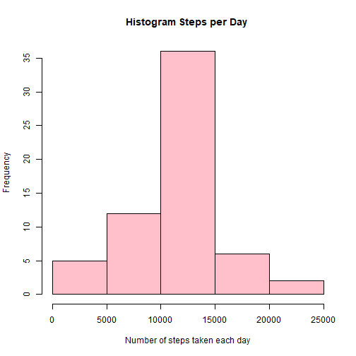
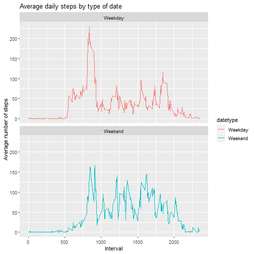

---

title: "Reproducible Research: Peer Assessment 1"
author: "Maria Jose Figueroa "
date: "6/9/2020"
output: 
  html_document:
    keep_md: true
    fig_caption: yes
---
First we download the data for this assignment,contained in a csv.


```r
library(knitr)
setwd("C:/Users/Maria Jose Figueroa/Desktop/Reproducible Research/Semana2")
activity_data <- read.csv("./activity.csv")
summ<-summary(activity_data)
print(summ, type= "html")
```

```
##      steps            date              interval     
##  Min.   :  0.00   Length:17568       Min.   :   0.0  
##  1st Qu.:  0.00   Class :character   1st Qu.: 588.8  
##  Median :  0.00   Mode  :character   Median :1177.5  
##  Mean   : 37.38                      Mean   :1177.5  
##  3rd Qu.: 12.00                      3rd Qu.:1766.2  
##  Max.   :806.00                      Max.   :2355.0  
##  NA's   :2304
```

## What is mean total number of steps taken per day?


First we need to merge the *"Steps"* and *"Date"* variables and clean the missing values on the variable we are going to use.

```r
Steps_day<- aggregate(steps~date,activity_data, sum, na.rm=TRUE)
hist(Steps_day$steps,main = "Histogram Steps per Day ", xlab = "Number of steps taken each day", col = "purple")
```



Then we must calculate and report the mean and median of the total number of steps taken per day.


```r
mean_Steps_day<-mean(Steps_day$steps)
mean_Steps_day
```

```
## [1] 10766.19
```

```r
median_Steps_day<-median(Steps_day$steps)
median_Steps_day
```

```
## [1] 10765
```


## What is the average daily activity pattern?
Now we make a time series plot  of the 5-minute interval  and the average number of steps taken.

```r
Steps_intervale<- aggregate(steps~interval,activity_data, mean, na.rm=TRUE)
plot(steps~interval, data=Steps_intervale, type="l",col="purple",xlab = "5-minute interval",ylab = "Average number of steps taken", main="Average number of steps taken per interval")
```


The 5-minute interval, on average across all the days in the dataset, that contains the maximum number of steps is:

```r
interval_max_steps <- Steps_intervale[which.max(Steps_intervale$steps),]$interval
interval_max_steps
```

```
## [1] 835
```

##Imputing missing values
Later, we must see how much missing values are present in the data set.

```r
Missing_values_Steps<-sum(is.na(activity_data$steps))
Missing_values_Date<-sum(is.na(activity_data$date))
Missing_values_Interval<-sum(is.na(activity_data$interval))
Total_missing_values<-sum(Missing_values_Date,Missing_values_Interval,Missing_values_Steps)
Total_missing_values
```

```
## [1] 2304
```
Then we create a strategy for filling in all of the missing values in the data set, in this case we will get the mean.

```r
Strategy_steps <- function(interval){
   Steps_intervale[Steps_intervale$interval==interval,]$steps
}

sum(is.na(Steps_intervale))
```

```
## [1] 0
```
Notice that we check out that there is no more missing values in the sub data set *"Steps_intervale"*. Then we create a new data set that is equal to the original data set but with the missing data filled in.

```r
activity_imputed <- transform(activity_data, steps = ifelse(is.na(activity_data$steps), yes = Steps_intervale$steps, no = activity_data$steps))
Steps_day_2 <- aggregate(steps ~ date, activity_imputed, sum)
names(Steps_day_2) <- c("date", "daily_steps")
```

Now we must make a histogram of the total number of steps taken each day because we must compare it with the old one.

```r
hist(Steps_day_2$daily_steps,main = "Histogram Steps per Day ", xlab = "Number of steps taken each day", col = "pink")
```


We can see that the frecuency of the number of steps taken each day is greater between 10000 steps and 15000 steps, before it was about 25 but now it comes to 35. So there is clear conclution that the NA's cause errors in data analysis.
Now, we must calculate and report the mean and median total number of steps taken per day and see if these values differ from the estimates from the first part of the assignment

```r
mean_Steps_day_2<-mean(Steps_day_2$daily_steps)
mean_Steps_day_2
```

```
## [1] 10766.19
```

```r
median_Steps_day_2<-median(Steps_day_2$daily_steps)
median_Steps_day_2
```

```
## [1] 10766.19
```
We can see here that the mean or median does not get too much affected by the presence of missing values.
##Are there differences in activity patterns between weekdays and weekends?
Here we create a new factor variable in the data set with two levels – “weekday” and “weekend” indicating whether a given date is a weekday or weekend day.


```r
activity_imputed$date<-as.Date(strptime(activity_imputed$date, format="%Y-%m-%d"))

activity_imputed$datetype <- sapply(activity_imputed$date, function(x) {
        if (weekdays(x) == "sábado" | weekdays(x) =="domingo") 
                {y <- "Weekend"} else 
                {y <- "Weekday"}
                y
        })
str(activity_imputed)
```

```
## 'data.frame':	17568 obs. of  4 variables:
##  $ steps   : num  1.717 0.3396 0.1321 0.1509 0.0755 ...
##  $ date    : Date, format: "2012-10-01" "2012-10-01" ...
##  $ interval: int  0 5 10 15 20 25 30 35 40 45 ...
##  $ datetype: chr  "Weekday" "Weekday" "Weekday" "Weekday" ...
```
Additionally I want to see how much people go out on weekends compared to weekdays.

```r
activity_by_date <- aggregate(steps~interval + datetype, activity_imputed, mean, na.rm = TRUE)
library(ggplot2)
plot<- ggplot(activity_by_date, aes(x = interval , y = steps, color = datetype)) +
       geom_line() +
       labs(title = "Average daily steps by type of date", x = "Interval", y = "Average number of steps") +
       facet_wrap(~datetype, ncol = 1, nrow=2)
print(plot)
```




```r
knit("./PA1_template/Course Project 1.Rmd")
```

```
## Warning in file(con, "r"): no fue posible abrir el archivo './PA1_template/Course
## Project 1.Rmd': No such file or directory
```

```
## Error in file(con, "r"): no se puede abrir la conexión
```


